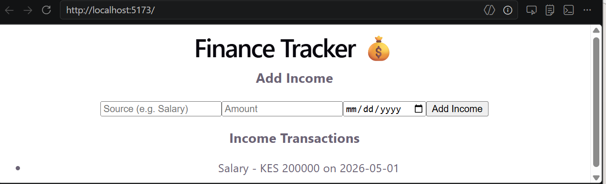

# Week 12: Portfolio — Finance Tracker & Weekly Projects

## Author

- **Name:** Dolla Grace Ambwaya
- **GitHub:** [@dollagraceambwaya-commits](https://github.com/dollagraceambwaya-commits)
- **Date:** May 3, 2026

## Project Description

This portfolio showcases my programming journey at IYF Weekend Academy.  
It includes:

- A **Home page** with navigation and introduction.
- An **About page** with my bio, profile photo, and interests.
- A **Contact page** with email, phone, and LinkedIn details.
- A **Projects page** featuring my group project (Finance Tracker — Income Module) and weekly repos (Weeks 1–12) covering foundations, CSS, JavaScript, React, backend, and deployment.

## Technologies Used

- HTML5 & CSS3
- JavaScript (ES6: async/await, DOM events)
- React 18 (components, props, state, hooks)
- Vite (development server & build tool)
- Node.js & Express (backend basics)
- Git & GitHub (version control)

## Features

- **Portfolio site** with Home, About, Contact, and Projects pages
- **Finance Tracker project** with IncomeForm & IncomeList components
- **Weekly repos** showing progression from Week 1 (Foundations) to Week 12 (Deployment)
- Responsive design and clean navigation
- GitHub integration for visibility and collaboration

## How to Run

1. Clone this repository:
   ```bash
   git clone https://github.com/dollagraceambwaya-commits/dollagraceambwaya-commits
   Open index.html in your browser
   OR
   ```
2. Navigate to project folders and run:

```
  bash
  npm install
```

3. npm run dev

## Lessons Learned

- Building a structured portfolio with multiple pages

- Documenting projects with consistent README templates

- Organizing weekly repos for clarity and progression

## Challenges Faced

- Designing consistent navigation across all pages

- Keeping styling cohesive between Home, About, Contact, and Projects

- Linking weekly repos and Finance Tracker clearly in one portfolio

- Ensuring professional polish and readability in README documentation

## Screenshots (Finance Tracker)



## Live Demo (if deployed)

[View Live Demo](https://dollagraceambwaya-commits.github.io/)

```

```
